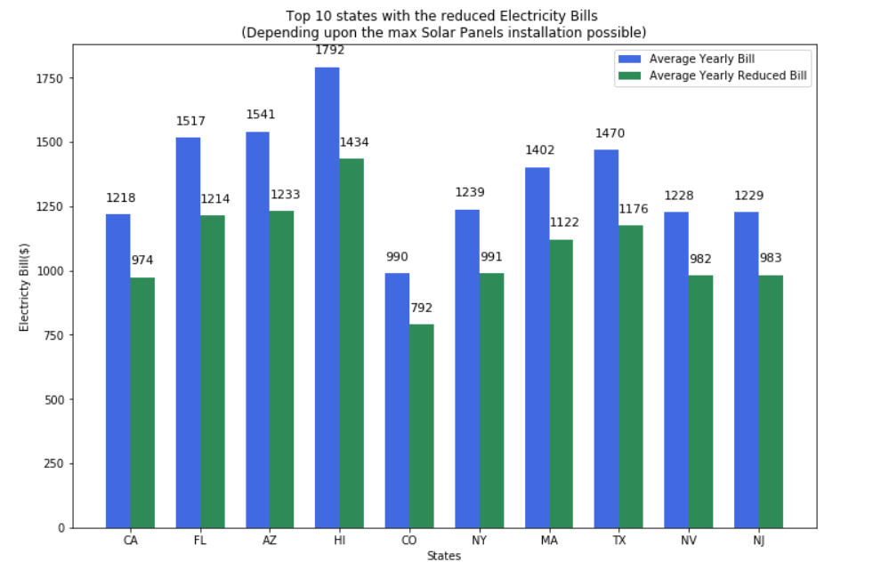
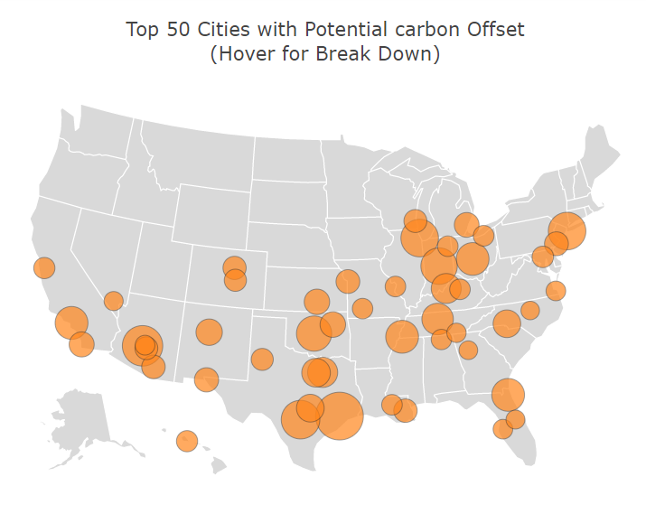
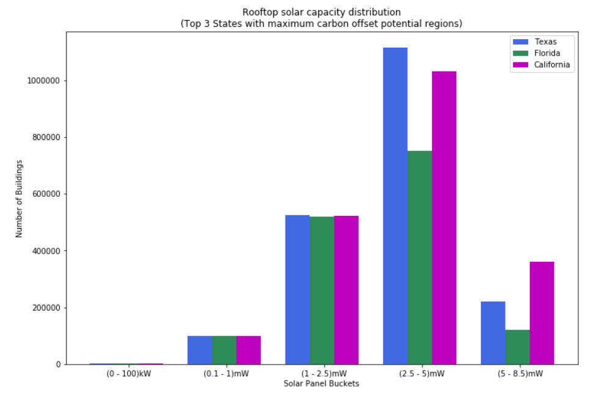

# Google Sunroof Analysis - Get your Power from the Sun
As the price of installing solar has gotten less expensive, more homeowners are turning to it as a possible option for decreasing their energy bill. We want to make installing solar panels easy and understandable for anyone. Project Sunroof puts Google's expansive data in mapping and computing resources to use, helping calculate the best solar plan for you. Project Sunroof computes how much sunlight hits your roof in a year. It takes into account: Google's database of imagery and maps 3D modeling of your roof Shadows cast by nearby structures and trees All possible sun positions over the course of a year Historical cloud and temperature patterns that might affect solar energy production. Data is available state wise, city wise, county wise, census wise on https://www.google.com/get/sunroof.

### About

We try to find out the reduction in the electricity bill per state in the US after the installation of 5kW power of photovoltic system. We also try to find out how the carbon offset can be increased reducing the carbon footprint by installing more solar panels. 

### Install

This project requires **Python 3** and the following Python libraries installed:

- [pandas](https://pandas.org/)
- [Matplotlib](https://matplotlib.org/)
- [Plotly](https://plot.ly/python/)
- [Linear Regression](https://scikit-learn.org/stable/auto_examples/linear_model/plot_ols.html)

Make sure you have [Jupyter Notebook](http://ipython.org/notebook.html) installed.

You could just install [Anaconda](http://continuum.io/downloads) distribution of Python, which already has the above packages and more included. 

### Run

In a terminal or command window, navigate to the top-level project directory (that contains this README) and run one of the following commands and also make sure sunroofanalysis_function.py is in the same directory as the sunroofanalysis.ipynb. I am importing some user defined functions from the python file :

```bash
ipython notebook sunroofanalysis.ipynb
```  
or
```bash
jupyter notebook sunroofanalysis.ipynb
```

This will open the Jupyter Notebook software and project file in your browser.

## Results 
When we install the photovoltic system of 5kW, we can see the reduction in the electricity bill (Top 10 States):



Top 50 cities with potential carbon offset:



The carbon offset can be increased, considering solar panels System; by increasing the solar panels. Top 3 states which contains the maximum carbon offset potential regions and how many solar panels can be installed in the ranges of 0 kW to 8 mW:



## Contributing
Pull requests are welcome. For major changes, please open an issue first to discuss what you would like to change.

Please make sure to update tests as appropriate.
